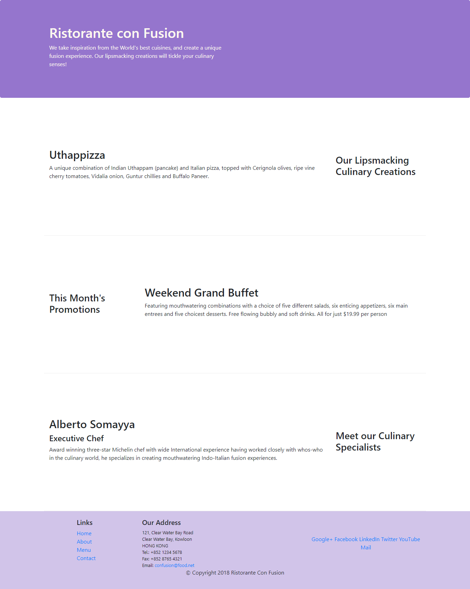

# Week one:
At the of the week one, We have learned:
- What is a Full-Stack Web Developer
- Setting up Our Development Environment: Git and Node
- Control version using Github
- Use Node-based modules to perform basic operations.
- Responsive Web Design
- Bootstrap Grid System
- Bootstrap Flex Behaviors

Desktop web page edition

Mobile web page edition

##Note: I'm not including images from the final Assignment 1 but the page is available in the folder Bootstrap4/conFusion
