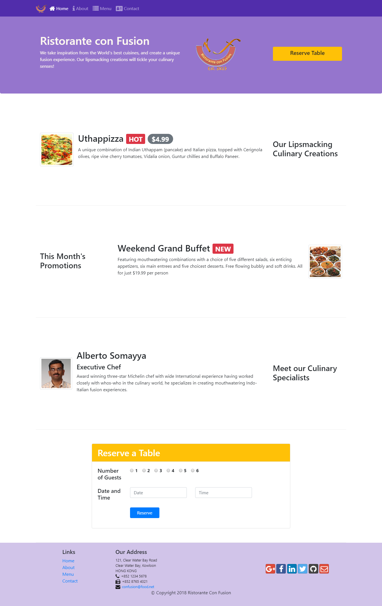

# Week two:
At the end of the week two, We have learned:
- How to create a responsive and collapse navbar
- Toggler navbar
- Usage and implementation of some Javascript clases in Bootstrap
- Usage of Bootstrap's  breadcrumb class
- Font-awesome icons and Bootstrap-social icons
- Create and style buttons on a web page using Bootstrap button classes
- Create and style forms on a web page using Bootstrap form classes
- Use a Button Group to group together related buttons
- Usage of Tables and Cards
- Images and Media
- Alerts, Badges, Progress Bars

# Desktop web page edition

# Mobile web page edition

### If you want to see the page working in your computer just do this:
- Install Node JS
- Open a terminal inside of the folder ***/conFusion/***
- Type the following commands
- npm install
- npm start
