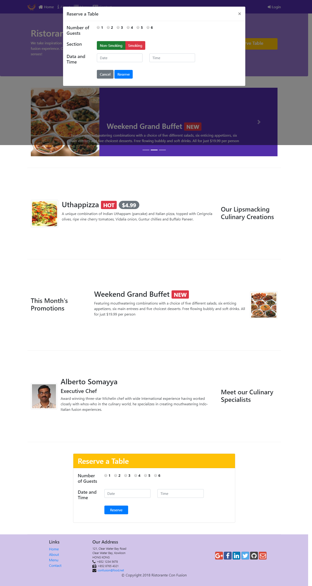
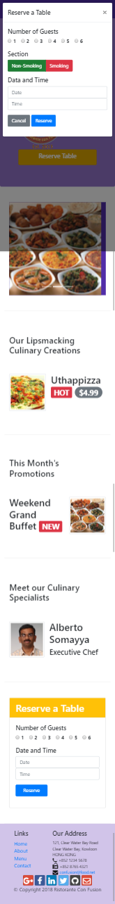

# Week Three:
At the end of the week three, We have learned:
- Design a tabbed navigation
- Use tab panes to organize the content and navigate the content using tabbed navigation
- Use the collapse plugin to hide/reveal content
- Construct the accordion using cards
- Set up a tooltip to be displayed when the user hovers over an area of the page
- Enable popovers when the user clicks on a link or button
- Reveal and hide modals when the user clicks on a link or button
- Use a carousel component in your web page
- Configure various aspects of the carousel
- Add controls to the carousel to manually control it

# Desktop web page version

# Mobile web page version

### If you want to see the page working in your computer just do this:
- Install Node JS
- Open a terminal inside of the folder ***/conFusion/***
- Type the following commands
- npm install
- npm start
