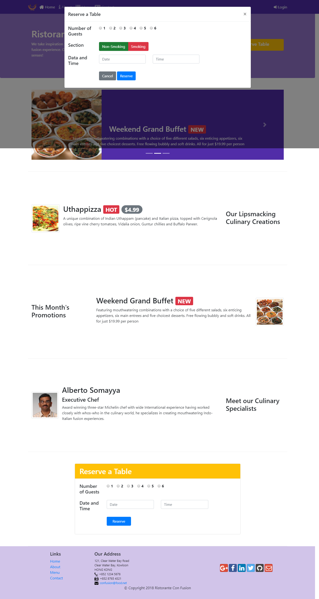
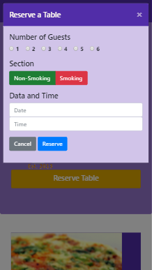

# Week Four:
At the end of the week four, We have learned:
- Understand how to use JQuery, JavaScript and Bootstrap's JS components methods to control the behavior of the components.
- Write JavaScript code taking advantage of the Bootstrap's JS component methods and JQuery methods for controlling Bootstrap JS components.
- Write Less and Sass code to define your CSS classes.
- Compile the Less and Sass code into the corresponding CSS classes.
- Configure NPM scripts and automate your web development.
- Prepare your project for being hosted on a web server.

# Desktop web page version

# Mobile web page version

### If you want to see the page working in your computer just do this:
- Install Node JS
- Open a terminal inside of the folder ***/conFusion/***
- Type the following commands
- npm install
- npm start
