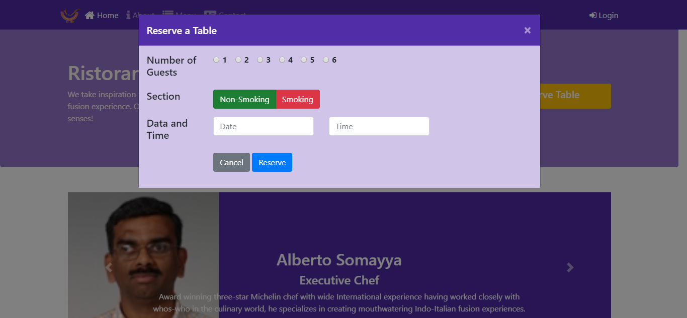

# Week Four:
At the end of the week four, We have learned:
- Understand how to use JQuery, JavaScript and Bootstrap's JS components methods to control the behavior of the components.
- Write JavaScript code taking advantage of the Bootstrap's JS component methods and JQuery methods for controlling Bootstrap JS components.
- Write Less and Sass code to define your CSS classes.
- Compile the Less and Sass code into the corresponding CSS classes.
- Configure NPM scripts and automate your web development.
- Prepare your project for being hosted on a web server.
- Usage of Parallelshell for run multiples commands.
- Usage of imagemin-cli.
- Compressing and minify images.
- How to use usemin-cli, cssmin, uglify-js, htmlmin.
- Creation of a Distribution folder with our project ready for deployment.
- Configure Grunt tasks and automate your web development using Grunt.
- Define Gulp tasks in code to automate the web development using Gulp.

# Desktop web page version

# Mobile web page version

### If you want to see the page working in your computer just do this:
- Install Node JS
- Open a terminal inside of the folder ***/conFusion/***
- Type the following commands
- npm install
- npm start

## Extra information NPM Script
### NPM Modules that were installed globally and locally:
> - [onchange](https://github.com/Qard/onchange)
> - [parallelshell](https://github.com/keithamus/parallelshell)
> - [rimraf](https://github.com/isaacs/rimraf)
> - [copyfiles](https://github.com/calvinmetcalf/copyfiles)
> - [imagemin-cli](https://github.com/imagemin/imagemin-cli)
> - [usemin-cli](https://github.com/nelsyeung/usemin-cli)
> - [cssmin](https://github.com/jbleuzen/node-cssmin)
> - [uglify-js](https://github.com/mishoo/UglifyJS2)
> - [htmlmin](https://github.com/jserme/htmlmin)
### Modules' instructions:
> 
> **LESS Compiler**
> - npm install -g less
>     -  lessc styles.less styles.css
> 
> **SASS Compiler**
> - npm install --save-dev node-sass
>     - node-sass -o css/ css/
>
> **Onchange && parallelshel@3.0.1**
> - npm install --save-dev onchange parallelshell@3.0.1
>     - onchange 'css/*.scss' -- npm run scss
>     - parallelshell 'npm run watch:scss' 'npm run lite'
> 
> **Dist: for upload and deploy the project**
> - npm install --save-dev rimraf
> - npm install -g copyfiles
> - npm install -g imagemin-cli
> - npm install --save-dev usemin-cli cssmin uglify-js htmlmin

## Extra information Grunt

### Grunt Plugins:

> - [grunt-contrib-jshint](https://github.com/gruntjs/grunt-contrib-jshint)
> - [jshint-stylish](https://github.com/sindresorhus/jshint-stylish)
> - [grunt-contrib-copy](https://github.com/gruntjs/grunt-contrib-copy)
> - [grunt-contrib-clean](https://github.com/gruntjs/grunt-contrib-clean)
> - [grunt-usemin](https://github.com/yeoman/grunt-usemin)
> - [grunt-contrib-concat](https://github.com/gruntjs/grunt-contrib-concat)
> - [grunt-contrib-cssmin](https://github.com/gruntjs/grunt-contrib-cssmin)
> - [grunt-contrib-htmlmin](https://github.com/gruntjs/grunt-contrib-htmlmin)
> - [grunt-contrib-uglify](https://github.com/gruntjs/grunt-contrib-uglify)
> - [grunt-filerev](https://github.com/yeoman/grunt-filerev)

### Grunt Plugins' installation instructions:
> - npm install -g grunt-cli
> - npm install --save-dev grunt
> - npm install --save-dev grunt-sass
> - npm install --save-dev time-grunt
> - npm install --save-dev jit-grunt
> - npm install --save-dev grunt-contrib-watch
> - npm install --save-dev grunt-browser-sync
> - npm install --save-dev grunt-contrib-copy
> - npm install --save-dev grunt-contrib-clean
> - npm install --save-dev grunt-contrib-imagemin
> - npm install --save-dev grunt-contrib-concat
> - npm install --save-dev grunt-contrib-cssmin
> - npm install --save-dev grunt-contrib-htmlmin
> - npm install --save-dev grunt-contrib-uglify
> - npm install --save-dev grunt-filerev
> - npm install --save-dev grunt-usemin

### Finally type this following instruction and everything should be working. 
> - grunt

## Extra information Gulp

### Gulp Plugins:

> - [gulp](https://github.com/gulpjs/gulp)
> - [gulp-sass](https://github.com/dlmanning/gulp-sass)
> - [browser-sync](https://github.com/BrowserSync/browser-sync)
> - [del](https://github.com/sindresorhus/del)
> - [gulp-imagemin](https://github.com/sindresorhus/gulp-imagemin)
> - [gulp-uglify](https://github.com/terinjokes/gulp-uglify)
> - [gulp-usemin](https://github.com/zont/gulp-usemin)
> - [gulp-rev](https://github.com/sindresorhus/gulp-rev)
> - [gulp-clean-css](https://github.com/scniro/gulp-clean-css)
> - [gulp-flatmap](https://github.com/mariusGundersen/gulp-flatMap)
> - [gulp-htmlmin](https://github.com/jonschlinkert/gulp-htmlmin)

### Grunt Plugins' installation instructions:
> - npm install --save-dev del
> - npm install --save-dev gulp-imagemin
> - npm install --save-dev gulp-uglify
> - npm install --save-dev gulp-usemin
> - npm install --save-dev gulp-rev
> - npm install --save-dev gulp-clean-css
> - npm install --save-dev gulp-flatmap
> - npm install --save-dev gulp-htmlmin

## Tasks done by NPM Scripts, Grunt and Gulp
> - [Minification](https://en.wikipedia.org/wiki/Minification_(programming))
> - [UglifyJS](http://lisperator.net/uglifyjs/)
> - [JSHint](http://jshint.com/)